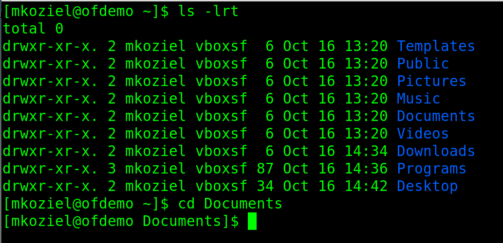
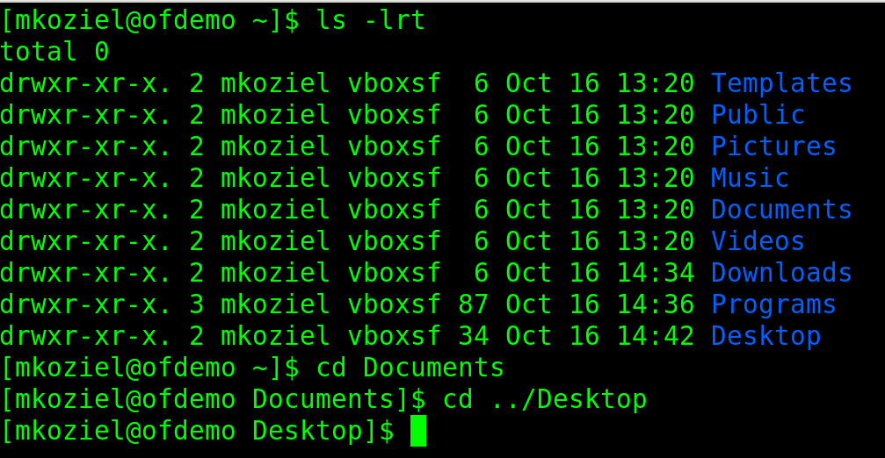
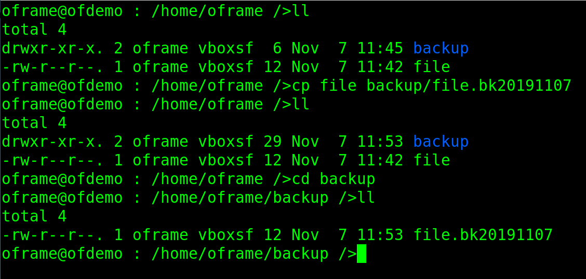
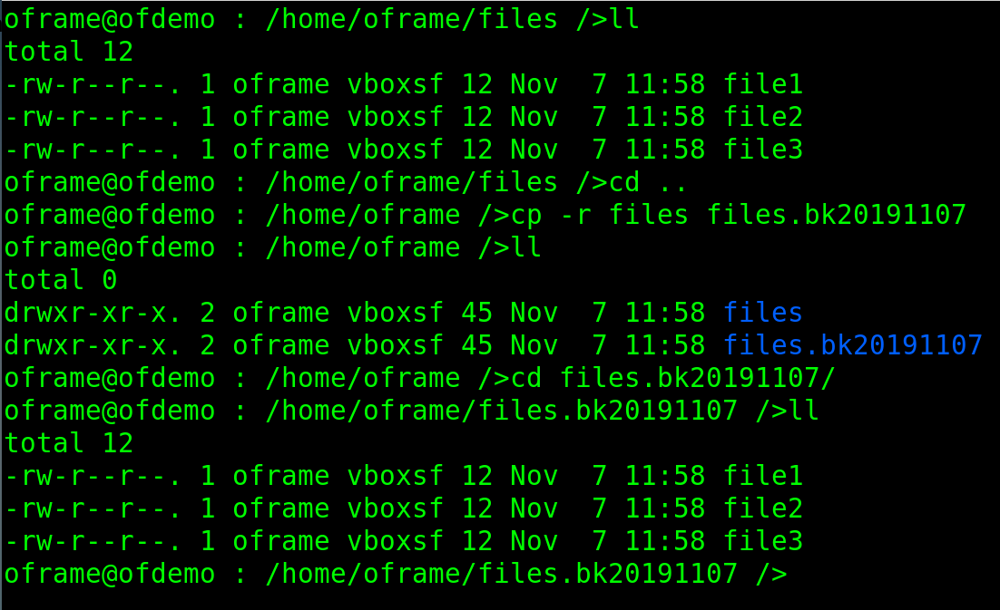
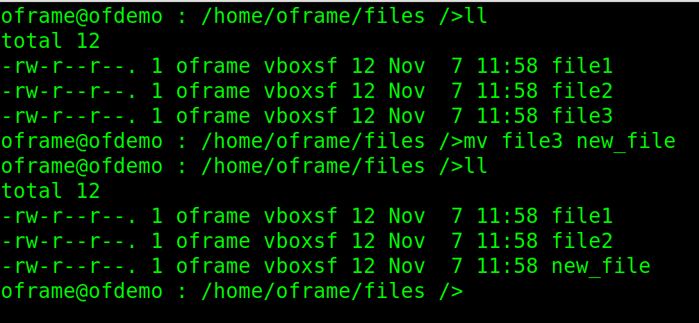
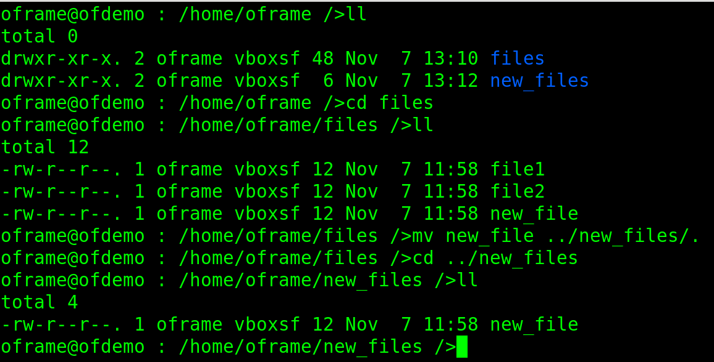

# Linux Commands Cheat Sheet

# Table of Contents

1. [ls - List Files and Directories](#1-ls-list-files-and-directories)
    1. [ls - Basic Usage](#example-11-basic-usage-ls)
    2. [ls - Long Listing](#example-12-long-listing-ls--l)
    3. [ls - Long Listing Time Based Reverse Order](#example-13-long-listing-based-on-time-and-reversed)
2. [cd - Change Directory](#2-cd-change-directory)
    1. [cd - Fully Qualified Path](#example-21-change-directory-to-fully-qualified-path)
    2. [cd - Up to Relative Path](#example-22-change-directory-up-to-relative-path)
    3. [cd - Down to relative Path](#example-23-change-directory-down-to-relative-path)
3. [cp - Copy Files and Directories](#3-cp-copy)
	1. [cp - Basic Usage](#example-31-basic-usage-copy-a-file)
	2. [cp - Copy a File From One Directory to Another](#example-32-copy-a-file-from-one-directory-to-another)
	3. [cp - Copy a Directory](#example-33-copy-a-directory)
4. [mv - Move](#mv-move)
	1. [mv - Use mv to Rename a file](#example-31-use-move-to-rename-a-file)
	2. [mv - Move a File to a Directory](#example-32-move-a-file-to-directory)
	3. [mv - Move a Directory to a Directory](#example-33-move-a-directory-to-directory)

## 1. ls (List Files and Directories)

**Description:** This command displays the files and directories located inside the directory you are currently in. You can add additional options to increase the amount of information displayed.

<details>
	<summary>Click Here for ls Usage</summary>
		<pre>
Usage:&nbsp;ls&nbsp;[OPTION]...&nbsp;[FILE]...
List&nbsp;information&nbsp;about&nbsp;the&nbsp;FILEs&nbsp;(the&nbsp;current&nbsp;directory&nbsp;by&nbsp;default).
Sort&nbsp;entries&nbsp;alphabetically&nbsp;if&nbsp;none&nbsp;of&nbsp;-cftuvSUX&nbsp;nor&nbsp;--sort&nbsp;is&nbsp;specified.

Mandatory&nbsp;arguments&nbsp;to&nbsp;long&nbsp;options&nbsp;are&nbsp;mandatory&nbsp;for&nbsp;short&nbsp;options&nbsp;too.
&nbsp;&nbsp;-a,&nbsp;--all&nbsp;&nbsp;&nbsp;&nbsp;&nbsp;&nbsp;&nbsp;&nbsp;&nbsp;&nbsp;&nbsp;&nbsp;&nbsp;&nbsp;&nbsp;&nbsp;&nbsp;&nbsp;do&nbsp;not&nbsp;ignore&nbsp;entries&nbsp;starting&nbsp;with&nbsp;.
&nbsp;&nbsp;-A,&nbsp;--almost-all&nbsp;&nbsp;&nbsp;&nbsp;&nbsp;&nbsp;&nbsp;&nbsp;&nbsp;&nbsp;&nbsp;do&nbsp;not&nbsp;list&nbsp;implied&nbsp;.&nbsp;and&nbsp;..
&nbsp;&nbsp;&nbsp;&nbsp;&nbsp;&nbsp;--author&nbsp;&nbsp;&nbsp;&nbsp;&nbsp;&nbsp;&nbsp;&nbsp;&nbsp;&nbsp;&nbsp;&nbsp;&nbsp;&nbsp;&nbsp;with&nbsp;-l,&nbsp;print&nbsp;the&nbsp;author&nbsp;of&nbsp;each&nbsp;file
&nbsp;&nbsp;-b,&nbsp;--escape&nbsp;&nbsp;&nbsp;&nbsp;&nbsp;&nbsp;&nbsp;&nbsp;&nbsp;&nbsp;&nbsp;&nbsp;&nbsp;&nbsp;&nbsp;print&nbsp;C-style&nbsp;escapes&nbsp;for&nbsp;nongraphic&nbsp;characters
&nbsp;&nbsp;&nbsp;&nbsp;&nbsp;&nbsp;--block-size=SIZE&nbsp;&nbsp;&nbsp;&nbsp;&nbsp;&nbsp;scale&nbsp;sizes&nbsp;by&nbsp;SIZE&nbsp;before&nbsp;printing&nbsp;them;&nbsp;e.g.,
&nbsp;&nbsp;&nbsp;&nbsp;&nbsp;&nbsp;&nbsp;&nbsp;&nbsp;&nbsp;&nbsp;&nbsp;&nbsp;&nbsp;&nbsp;&nbsp;&nbsp;&nbsp;&nbsp;&nbsp;&nbsp;&nbsp;&nbsp;&nbsp;&nbsp;&nbsp;&nbsp;&nbsp;&nbsp;&nbsp;&nbsp;'--block-size=M'&nbsp;prints&nbsp;sizes&nbsp;in&nbsp;units&nbsp;of
&nbsp;&nbsp;&nbsp;&nbsp;&nbsp;&nbsp;&nbsp;&nbsp;&nbsp;&nbsp;&nbsp;&nbsp;&nbsp;&nbsp;&nbsp;&nbsp;&nbsp;&nbsp;&nbsp;&nbsp;&nbsp;&nbsp;&nbsp;&nbsp;&nbsp;&nbsp;&nbsp;&nbsp;&nbsp;&nbsp;&nbsp;1,048,576&nbsp;bytes;&nbsp;see&nbsp;SIZE&nbsp;format&nbsp;below
&nbsp;&nbsp;-B,&nbsp;--ignore-backups&nbsp;&nbsp;&nbsp;&nbsp;&nbsp;&nbsp;&nbsp;do&nbsp;not&nbsp;list&nbsp;implied&nbsp;entries&nbsp;ending&nbsp;with&nbsp;~
&nbsp;&nbsp;-c&nbsp;&nbsp;&nbsp;&nbsp;&nbsp;&nbsp;&nbsp;&nbsp;&nbsp;&nbsp;&nbsp;&nbsp;&nbsp;&nbsp;&nbsp;&nbsp;&nbsp;&nbsp;&nbsp;&nbsp;&nbsp;&nbsp;&nbsp;&nbsp;&nbsp;with&nbsp;-lt:&nbsp;sort&nbsp;by,&nbsp;and&nbsp;show,&nbsp;ctime&nbsp;(time&nbsp;of&nbsp;last
&nbsp;&nbsp;&nbsp;&nbsp;&nbsp;&nbsp;&nbsp;&nbsp;&nbsp;&nbsp;&nbsp;&nbsp;&nbsp;&nbsp;&nbsp;&nbsp;&nbsp;&nbsp;&nbsp;&nbsp;&nbsp;&nbsp;&nbsp;&nbsp;&nbsp;&nbsp;&nbsp;&nbsp;&nbsp;&nbsp;&nbsp;modification&nbsp;of&nbsp;file&nbsp;status&nbsp;information);
&nbsp;&nbsp;&nbsp;&nbsp;&nbsp;&nbsp;&nbsp;&nbsp;&nbsp;&nbsp;&nbsp;&nbsp;&nbsp;&nbsp;&nbsp;&nbsp;&nbsp;&nbsp;&nbsp;&nbsp;&nbsp;&nbsp;&nbsp;&nbsp;&nbsp;&nbsp;&nbsp;&nbsp;&nbsp;&nbsp;&nbsp;with&nbsp;-l:&nbsp;show&nbsp;ctime&nbsp;and&nbsp;sort&nbsp;by&nbsp;name;
&nbsp;&nbsp;&nbsp;&nbsp;&nbsp;&nbsp;&nbsp;&nbsp;&nbsp;&nbsp;&nbsp;&nbsp;&nbsp;&nbsp;&nbsp;&nbsp;&nbsp;&nbsp;&nbsp;&nbsp;&nbsp;&nbsp;&nbsp;&nbsp;&nbsp;&nbsp;&nbsp;&nbsp;&nbsp;&nbsp;&nbsp;otherwise:&nbsp;sort&nbsp;by&nbsp;ctime,&nbsp;newest&nbsp;first
&nbsp;&nbsp;-C&nbsp;&nbsp;&nbsp;&nbsp;&nbsp;&nbsp;&nbsp;&nbsp;&nbsp;&nbsp;&nbsp;&nbsp;&nbsp;&nbsp;&nbsp;&nbsp;&nbsp;&nbsp;&nbsp;&nbsp;&nbsp;&nbsp;&nbsp;&nbsp;&nbsp;list&nbsp;entries&nbsp;by&nbsp;columns
&nbsp;&nbsp;&nbsp;&nbsp;&nbsp;&nbsp;--color[=WHEN]&nbsp;&nbsp;&nbsp;&nbsp;&nbsp;&nbsp;&nbsp;&nbsp;&nbsp;colorize&nbsp;the&nbsp;output;&nbsp;WHEN&nbsp;can&nbsp;be&nbsp;'never',&nbsp;'auto',
&nbsp;&nbsp;&nbsp;&nbsp;&nbsp;&nbsp;&nbsp;&nbsp;&nbsp;&nbsp;&nbsp;&nbsp;&nbsp;&nbsp;&nbsp;&nbsp;&nbsp;&nbsp;&nbsp;&nbsp;&nbsp;&nbsp;&nbsp;&nbsp;&nbsp;&nbsp;&nbsp;&nbsp;&nbsp;&nbsp;&nbsp;or&nbsp;'always'&nbsp;(the&nbsp;default);&nbsp;more&nbsp;info&nbsp;below
&nbsp;&nbsp;-d,&nbsp;--directory&nbsp;&nbsp;&nbsp;&nbsp;&nbsp;&nbsp;&nbsp;&nbsp;&nbsp;&nbsp;&nbsp;&nbsp;list&nbsp;directories&nbsp;themselves,&nbsp;not&nbsp;their&nbsp;contents
&nbsp;&nbsp;-D,&nbsp;--dired&nbsp;&nbsp;&nbsp;&nbsp;&nbsp;&nbsp;&nbsp;&nbsp;&nbsp;&nbsp;&nbsp;&nbsp;&nbsp;&nbsp;&nbsp;&nbsp;generate&nbsp;output&nbsp;designed&nbsp;for&nbsp;Emacs'&nbsp;dired&nbsp;mode
&nbsp;&nbsp;-f&nbsp;&nbsp;&nbsp;&nbsp;&nbsp;&nbsp;&nbsp;&nbsp;&nbsp;&nbsp;&nbsp;&nbsp;&nbsp;&nbsp;&nbsp;&nbsp;&nbsp;&nbsp;&nbsp;&nbsp;&nbsp;&nbsp;&nbsp;&nbsp;&nbsp;do&nbsp;not&nbsp;sort,&nbsp;enable&nbsp;-aU,&nbsp;disable&nbsp;-ls&nbsp;--color
&nbsp;&nbsp;-F,&nbsp;--classify&nbsp;&nbsp;&nbsp;&nbsp;&nbsp;&nbsp;&nbsp;&nbsp;&nbsp;&nbsp;&nbsp;&nbsp;&nbsp;append&nbsp;indicator&nbsp;(one&nbsp;of&nbsp;*/=>@|)&nbsp;to&nbsp;entries
&nbsp;&nbsp;&nbsp;&nbsp;&nbsp;&nbsp;--file-type&nbsp;&nbsp;&nbsp;&nbsp;&nbsp;&nbsp;&nbsp;&nbsp;&nbsp;&nbsp;&nbsp;&nbsp;likewise,&nbsp;except&nbsp;do&nbsp;not&nbsp;append&nbsp;'*'
&nbsp;&nbsp;&nbsp;&nbsp;&nbsp;&nbsp;--format=WORD&nbsp;&nbsp;&nbsp;&nbsp;&nbsp;&nbsp;&nbsp;&nbsp;&nbsp;&nbsp;across&nbsp;-x,&nbsp;commas&nbsp;-m,&nbsp;horizontal&nbsp;-x,&nbsp;long&nbsp;-l,
&nbsp;&nbsp;&nbsp;&nbsp;&nbsp;&nbsp;&nbsp;&nbsp;&nbsp;&nbsp;&nbsp;&nbsp;&nbsp;&nbsp;&nbsp;&nbsp;&nbsp;&nbsp;&nbsp;&nbsp;&nbsp;&nbsp;&nbsp;&nbsp;&nbsp;&nbsp;&nbsp;&nbsp;&nbsp;&nbsp;&nbsp;single-column&nbsp;-1,&nbsp;verbose&nbsp;-l,&nbsp;vertical&nbsp;-C
&nbsp;&nbsp;&nbsp;&nbsp;&nbsp;&nbsp;--full-time&nbsp;&nbsp;&nbsp;&nbsp;&nbsp;&nbsp;&nbsp;&nbsp;&nbsp;&nbsp;&nbsp;&nbsp;like&nbsp;-l&nbsp;--time-style=full-iso
&nbsp;&nbsp;-g&nbsp;&nbsp;&nbsp;&nbsp;&nbsp;&nbsp;&nbsp;&nbsp;&nbsp;&nbsp;&nbsp;&nbsp;&nbsp;&nbsp;&nbsp;&nbsp;&nbsp;&nbsp;&nbsp;&nbsp;&nbsp;&nbsp;&nbsp;&nbsp;&nbsp;like&nbsp;-l,&nbsp;but&nbsp;do&nbsp;not&nbsp;list&nbsp;owner
&nbsp;&nbsp;&nbsp;&nbsp;&nbsp;&nbsp;--group-directories-first
&nbsp;&nbsp;&nbsp;&nbsp;&nbsp;&nbsp;&nbsp;&nbsp;&nbsp;&nbsp;&nbsp;&nbsp;&nbsp;&nbsp;&nbsp;&nbsp;&nbsp;&nbsp;&nbsp;&nbsp;&nbsp;&nbsp;&nbsp;&nbsp;&nbsp;&nbsp;&nbsp;&nbsp;&nbsp;group&nbsp;directories&nbsp;before&nbsp;files;
&nbsp;&nbsp;&nbsp;&nbsp;&nbsp;&nbsp;&nbsp;&nbsp;&nbsp;&nbsp;&nbsp;&nbsp;&nbsp;&nbsp;&nbsp;&nbsp;&nbsp;&nbsp;&nbsp;&nbsp;&nbsp;&nbsp;&nbsp;&nbsp;&nbsp;&nbsp;&nbsp;&nbsp;&nbsp;&nbsp;&nbsp;can&nbsp;be&nbsp;augmented&nbsp;with&nbsp;a&nbsp;--sort&nbsp;option,&nbsp;but&nbsp;any
&nbsp;&nbsp;&nbsp;&nbsp;&nbsp;&nbsp;&nbsp;&nbsp;&nbsp;&nbsp;&nbsp;&nbsp;&nbsp;&nbsp;&nbsp;&nbsp;&nbsp;&nbsp;&nbsp;&nbsp;&nbsp;&nbsp;&nbsp;&nbsp;&nbsp;&nbsp;&nbsp;&nbsp;&nbsp;&nbsp;&nbsp;use&nbsp;of&nbsp;--sort=none&nbsp;(-U)&nbsp;disables&nbsp;grouping
&nbsp;&nbsp;-G,&nbsp;--no-group&nbsp;&nbsp;&nbsp;&nbsp;&nbsp;&nbsp;&nbsp;&nbsp;&nbsp;&nbsp;&nbsp;&nbsp;&nbsp;in&nbsp;a&nbsp;long&nbsp;listing,&nbsp;don't&nbsp;print&nbsp;group&nbsp;names
&nbsp;&nbsp;-h,&nbsp;--human-readable&nbsp;&nbsp;&nbsp;&nbsp;&nbsp;&nbsp;&nbsp;with&nbsp;-l,&nbsp;print&nbsp;sizes&nbsp;in&nbsp;human&nbsp;readable&nbsp;format
&nbsp;&nbsp;&nbsp;&nbsp;&nbsp;&nbsp;&nbsp;&nbsp;&nbsp;&nbsp;&nbsp;&nbsp;&nbsp;&nbsp;&nbsp;&nbsp;&nbsp;&nbsp;&nbsp;&nbsp;&nbsp;&nbsp;&nbsp;&nbsp;&nbsp;&nbsp;&nbsp;&nbsp;&nbsp;&nbsp;&nbsp;(e.g.,&nbsp;1K&nbsp;234M&nbsp;2G)
&nbsp;&nbsp;&nbsp;&nbsp;&nbsp;&nbsp;--si&nbsp;&nbsp;&nbsp;&nbsp;&nbsp;&nbsp;&nbsp;&nbsp;&nbsp;&nbsp;&nbsp;&nbsp;&nbsp;&nbsp;&nbsp;&nbsp;&nbsp;&nbsp;&nbsp;likewise,&nbsp;but&nbsp;use&nbsp;powers&nbsp;of&nbsp;1000&nbsp;not&nbsp;1024
&nbsp;&nbsp;-H,&nbsp;--dereference-command-line
&nbsp;&nbsp;&nbsp;&nbsp;&nbsp;&nbsp;&nbsp;&nbsp;&nbsp;&nbsp;&nbsp;&nbsp;&nbsp;&nbsp;&nbsp;&nbsp;&nbsp;&nbsp;&nbsp;&nbsp;&nbsp;&nbsp;&nbsp;&nbsp;&nbsp;&nbsp;&nbsp;&nbsp;&nbsp;follow&nbsp;symbolic&nbsp;links&nbsp;listed&nbsp;on&nbsp;the&nbsp;command&nbsp;line
&nbsp;&nbsp;&nbsp;&nbsp;&nbsp;&nbsp;--dereference-command-line-symlink-to-dir
&nbsp;&nbsp;&nbsp;&nbsp;&nbsp;&nbsp;&nbsp;&nbsp;&nbsp;&nbsp;&nbsp;&nbsp;&nbsp;&nbsp;&nbsp;&nbsp;&nbsp;&nbsp;&nbsp;&nbsp;&nbsp;&nbsp;&nbsp;&nbsp;&nbsp;&nbsp;&nbsp;&nbsp;&nbsp;follow&nbsp;each&nbsp;command&nbsp;line&nbsp;symbolic&nbsp;link
&nbsp;&nbsp;&nbsp;&nbsp;&nbsp;&nbsp;&nbsp;&nbsp;&nbsp;&nbsp;&nbsp;&nbsp;&nbsp;&nbsp;&nbsp;&nbsp;&nbsp;&nbsp;&nbsp;&nbsp;&nbsp;&nbsp;&nbsp;&nbsp;&nbsp;&nbsp;&nbsp;&nbsp;&nbsp;&nbsp;&nbsp;that&nbsp;points&nbsp;to&nbsp;a&nbsp;directory
&nbsp;&nbsp;&nbsp;&nbsp;&nbsp;&nbsp;--hide=PATTERN&nbsp;&nbsp;&nbsp;&nbsp;&nbsp;&nbsp;&nbsp;&nbsp;&nbsp;do&nbsp;not&nbsp;list&nbsp;implied&nbsp;entries&nbsp;matching&nbsp;shell&nbsp;PATTERN
&nbsp;&nbsp;&nbsp;&nbsp;&nbsp;&nbsp;&nbsp;&nbsp;&nbsp;&nbsp;&nbsp;&nbsp;&nbsp;&nbsp;&nbsp;&nbsp;&nbsp;&nbsp;&nbsp;&nbsp;&nbsp;&nbsp;&nbsp;&nbsp;&nbsp;&nbsp;&nbsp;&nbsp;&nbsp;&nbsp;&nbsp;(overridden&nbsp;by&nbsp;-a&nbsp;or&nbsp;-A)
&nbsp;&nbsp;&nbsp;&nbsp;&nbsp;&nbsp;--indicator-style=WORD&nbsp;&nbsp;append&nbsp;indicator&nbsp;with&nbsp;style&nbsp;WORD&nbsp;to&nbsp;entry&nbsp;names:
&nbsp;&nbsp;&nbsp;&nbsp;&nbsp;&nbsp;&nbsp;&nbsp;&nbsp;&nbsp;&nbsp;&nbsp;&nbsp;&nbsp;&nbsp;&nbsp;&nbsp;&nbsp;&nbsp;&nbsp;&nbsp;&nbsp;&nbsp;&nbsp;&nbsp;&nbsp;&nbsp;&nbsp;&nbsp;&nbsp;&nbsp;none&nbsp;(default),&nbsp;slash&nbsp;(-p),
&nbsp;&nbsp;&nbsp;&nbsp;&nbsp;&nbsp;&nbsp;&nbsp;&nbsp;&nbsp;&nbsp;&nbsp;&nbsp;&nbsp;&nbsp;&nbsp;&nbsp;&nbsp;&nbsp;&nbsp;&nbsp;&nbsp;&nbsp;&nbsp;&nbsp;&nbsp;&nbsp;&nbsp;&nbsp;&nbsp;&nbsp;file-type&nbsp;(--file-type),&nbsp;classify&nbsp;(-F)
&nbsp;&nbsp;-i,&nbsp;--inode&nbsp;&nbsp;&nbsp;&nbsp;&nbsp;&nbsp;&nbsp;&nbsp;&nbsp;&nbsp;&nbsp;&nbsp;&nbsp;&nbsp;&nbsp;&nbsp;print&nbsp;the&nbsp;index&nbsp;number&nbsp;of&nbsp;each&nbsp;file
&nbsp;&nbsp;-I,&nbsp;--ignore=PATTERN&nbsp;&nbsp;&nbsp;&nbsp;&nbsp;&nbsp;&nbsp;do&nbsp;not&nbsp;list&nbsp;implied&nbsp;entries&nbsp;matching&nbsp;shell&nbsp;PATTERN
&nbsp;&nbsp;-k,&nbsp;--kibibytes&nbsp;&nbsp;&nbsp;&nbsp;&nbsp;&nbsp;&nbsp;&nbsp;&nbsp;&nbsp;&nbsp;&nbsp;default&nbsp;to&nbsp;1024-byte&nbsp;blocks&nbsp;for&nbsp;disk&nbsp;usage
&nbsp;&nbsp;-l&nbsp;&nbsp;&nbsp;&nbsp;&nbsp;&nbsp;&nbsp;&nbsp;&nbsp;&nbsp;&nbsp;&nbsp;&nbsp;&nbsp;&nbsp;&nbsp;&nbsp;&nbsp;&nbsp;&nbsp;&nbsp;&nbsp;&nbsp;&nbsp;&nbsp;use&nbsp;a&nbsp;long&nbsp;listing&nbsp;format
&nbsp;&nbsp;-L,&nbsp;--dereference&nbsp;&nbsp;&nbsp;&nbsp;&nbsp;&nbsp;&nbsp;&nbsp;&nbsp;&nbsp;when&nbsp;showing&nbsp;file&nbsp;information&nbsp;for&nbsp;a&nbsp;symbolic
&nbsp;&nbsp;&nbsp;&nbsp;&nbsp;&nbsp;&nbsp;&nbsp;&nbsp;&nbsp;&nbsp;&nbsp;&nbsp;&nbsp;&nbsp;&nbsp;&nbsp;&nbsp;&nbsp;&nbsp;&nbsp;&nbsp;&nbsp;&nbsp;&nbsp;&nbsp;&nbsp;&nbsp;&nbsp;&nbsp;&nbsp;link,&nbsp;show&nbsp;information&nbsp;for&nbsp;the&nbsp;file&nbsp;the&nbsp;link
&nbsp;&nbsp;&nbsp;&nbsp;&nbsp;&nbsp;&nbsp;&nbsp;&nbsp;&nbsp;&nbsp;&nbsp;&nbsp;&nbsp;&nbsp;&nbsp;&nbsp;&nbsp;&nbsp;&nbsp;&nbsp;&nbsp;&nbsp;&nbsp;&nbsp;&nbsp;&nbsp;&nbsp;&nbsp;&nbsp;&nbsp;references&nbsp;rather&nbsp;than&nbsp;for&nbsp;the&nbsp;link&nbsp;itself
&nbsp;&nbsp;-m&nbsp;&nbsp;&nbsp;&nbsp;&nbsp;&nbsp;&nbsp;&nbsp;&nbsp;&nbsp;&nbsp;&nbsp;&nbsp;&nbsp;&nbsp;&nbsp;&nbsp;&nbsp;&nbsp;&nbsp;&nbsp;&nbsp;&nbsp;&nbsp;&nbsp;fill&nbsp;width&nbsp;with&nbsp;a&nbsp;comma&nbsp;separated&nbsp;list&nbsp;of&nbsp;entries
&nbsp;&nbsp;-n,&nbsp;--numeric-uid-gid&nbsp;&nbsp;&nbsp;&nbsp;&nbsp;&nbsp;like&nbsp;-l,&nbsp;but&nbsp;list&nbsp;numeric&nbsp;user&nbsp;and&nbsp;group&nbsp;IDs
&nbsp;&nbsp;-N,&nbsp;--literal&nbsp;&nbsp;&nbsp;&nbsp;&nbsp;&nbsp;&nbsp;&nbsp;&nbsp;&nbsp;&nbsp;&nbsp;&nbsp;&nbsp;print&nbsp;raw&nbsp;entry&nbsp;names&nbsp;(don't&nbsp;treat&nbsp;e.g.&nbsp;control
&nbsp;&nbsp;&nbsp;&nbsp;&nbsp;&nbsp;&nbsp;&nbsp;&nbsp;&nbsp;&nbsp;&nbsp;&nbsp;&nbsp;&nbsp;&nbsp;&nbsp;&nbsp;&nbsp;&nbsp;&nbsp;&nbsp;&nbsp;&nbsp;&nbsp;&nbsp;&nbsp;&nbsp;&nbsp;&nbsp;&nbsp;characters&nbsp;specially)
&nbsp;&nbsp;-o&nbsp;&nbsp;&nbsp;&nbsp;&nbsp;&nbsp;&nbsp;&nbsp;&nbsp;&nbsp;&nbsp;&nbsp;&nbsp;&nbsp;&nbsp;&nbsp;&nbsp;&nbsp;&nbsp;&nbsp;&nbsp;&nbsp;&nbsp;&nbsp;&nbsp;like&nbsp;-l,&nbsp;but&nbsp;do&nbsp;not&nbsp;list&nbsp;group&nbsp;information
&nbsp;&nbsp;-p,&nbsp;--indicator-style=slash
&nbsp;&nbsp;&nbsp;&nbsp;&nbsp;&nbsp;&nbsp;&nbsp;&nbsp;&nbsp;&nbsp;&nbsp;&nbsp;&nbsp;&nbsp;&nbsp;&nbsp;&nbsp;&nbsp;&nbsp;&nbsp;&nbsp;&nbsp;&nbsp;&nbsp;&nbsp;&nbsp;&nbsp;&nbsp;append&nbsp;/&nbsp;indicator&nbsp;to&nbsp;directories
&nbsp;&nbsp;-q,&nbsp;--hide-control-chars&nbsp;&nbsp;&nbsp;print&nbsp;?&nbsp;instead&nbsp;of&nbsp;nongraphic&nbsp;characters
&nbsp;&nbsp;&nbsp;&nbsp;&nbsp;&nbsp;--show-control-chars&nbsp;&nbsp;&nbsp;show&nbsp;nongraphic&nbsp;characters&nbsp;as-is&nbsp;(the&nbsp;default,
&nbsp;&nbsp;&nbsp;&nbsp;&nbsp;&nbsp;&nbsp;&nbsp;&nbsp;&nbsp;&nbsp;&nbsp;&nbsp;&nbsp;&nbsp;&nbsp;&nbsp;&nbsp;&nbsp;&nbsp;&nbsp;&nbsp;&nbsp;&nbsp;&nbsp;&nbsp;&nbsp;&nbsp;&nbsp;&nbsp;&nbsp;unless&nbsp;program&nbsp;is&nbsp;'ls'&nbsp;and&nbsp;output&nbsp;is&nbsp;a&nbsp;terminal)
&nbsp;&nbsp;-Q,&nbsp;--quote-name&nbsp;&nbsp;&nbsp;&nbsp;&nbsp;&nbsp;&nbsp;&nbsp;&nbsp;&nbsp;&nbsp;enclose&nbsp;entry&nbsp;names&nbsp;in&nbsp;double&nbsp;quotes
&nbsp;&nbsp;&nbsp;&nbsp;&nbsp;&nbsp;--quoting-style=WORD&nbsp;&nbsp;&nbsp;use&nbsp;quoting&nbsp;style&nbsp;WORD&nbsp;for&nbsp;entry&nbsp;names:
&nbsp;&nbsp;&nbsp;&nbsp;&nbsp;&nbsp;&nbsp;&nbsp;&nbsp;&nbsp;&nbsp;&nbsp;&nbsp;&nbsp;&nbsp;&nbsp;&nbsp;&nbsp;&nbsp;&nbsp;&nbsp;&nbsp;&nbsp;&nbsp;&nbsp;&nbsp;&nbsp;&nbsp;&nbsp;&nbsp;&nbsp;literal,&nbsp;locale,&nbsp;shell,&nbsp;shell-always,&nbsp;c,&nbsp;escape
&nbsp;&nbsp;-r,&nbsp;--reverse&nbsp;&nbsp;&nbsp;&nbsp;&nbsp;&nbsp;&nbsp;&nbsp;&nbsp;&nbsp;&nbsp;&nbsp;&nbsp;&nbsp;reverse&nbsp;order&nbsp;while&nbsp;sorting
&nbsp;&nbsp;-R,&nbsp;--recursive&nbsp;&nbsp;&nbsp;&nbsp;&nbsp;&nbsp;&nbsp;&nbsp;&nbsp;&nbsp;&nbsp;&nbsp;list&nbsp;subdirectories&nbsp;recursively
&nbsp;&nbsp;-s,&nbsp;--size&nbsp;&nbsp;&nbsp;&nbsp;&nbsp;&nbsp;&nbsp;&nbsp;&nbsp;&nbsp;&nbsp;&nbsp;&nbsp;&nbsp;&nbsp;&nbsp;&nbsp;print&nbsp;the&nbsp;allocated&nbsp;size&nbsp;of&nbsp;each&nbsp;file,&nbsp;in&nbsp;blocks
&nbsp;&nbsp;-S&nbsp;&nbsp;&nbsp;&nbsp;&nbsp;&nbsp;&nbsp;&nbsp;&nbsp;&nbsp;&nbsp;&nbsp;&nbsp;&nbsp;&nbsp;&nbsp;&nbsp;&nbsp;&nbsp;&nbsp;&nbsp;&nbsp;&nbsp;&nbsp;&nbsp;sort&nbsp;by&nbsp;file&nbsp;size
&nbsp;&nbsp;&nbsp;&nbsp;&nbsp;&nbsp;--sort=WORD&nbsp;&nbsp;&nbsp;&nbsp;&nbsp;&nbsp;&nbsp;&nbsp;&nbsp;&nbsp;&nbsp;&nbsp;sort&nbsp;by&nbsp;WORD&nbsp;instead&nbsp;of&nbsp;name:&nbsp;none&nbsp;(-U),&nbsp;size&nbsp;(-S),
&nbsp;&nbsp;&nbsp;&nbsp;&nbsp;&nbsp;&nbsp;&nbsp;&nbsp;&nbsp;&nbsp;&nbsp;&nbsp;&nbsp;&nbsp;&nbsp;&nbsp;&nbsp;&nbsp;&nbsp;&nbsp;&nbsp;&nbsp;&nbsp;&nbsp;&nbsp;&nbsp;&nbsp;&nbsp;&nbsp;&nbsp;time&nbsp;(-t),&nbsp;version&nbsp;(-v),&nbsp;extension&nbsp;(-X)
&nbsp;&nbsp;&nbsp;&nbsp;&nbsp;&nbsp;--time=WORD&nbsp;&nbsp;&nbsp;&nbsp;&nbsp;&nbsp;&nbsp;&nbsp;&nbsp;&nbsp;&nbsp;&nbsp;with&nbsp;-l,&nbsp;show&nbsp;time&nbsp;as&nbsp;WORD&nbsp;instead&nbsp;of&nbsp;default
&nbsp;&nbsp;&nbsp;&nbsp;&nbsp;&nbsp;&nbsp;&nbsp;&nbsp;&nbsp;&nbsp;&nbsp;&nbsp;&nbsp;&nbsp;&nbsp;&nbsp;&nbsp;&nbsp;&nbsp;&nbsp;&nbsp;&nbsp;&nbsp;&nbsp;&nbsp;&nbsp;&nbsp;&nbsp;&nbsp;&nbsp;modification&nbsp;time:&nbsp;atime&nbsp;or&nbsp;access&nbsp;or&nbsp;use&nbsp;(-u)
&nbsp;&nbsp;&nbsp;&nbsp;&nbsp;&nbsp;&nbsp;&nbsp;&nbsp;&nbsp;&nbsp;&nbsp;&nbsp;&nbsp;&nbsp;&nbsp;&nbsp;&nbsp;&nbsp;&nbsp;&nbsp;&nbsp;&nbsp;&nbsp;&nbsp;&nbsp;&nbsp;&nbsp;&nbsp;&nbsp;&nbsp;ctime&nbsp;or&nbsp;status&nbsp;(-c);&nbsp;also&nbsp;use&nbsp;specified&nbsp;time
&nbsp;&nbsp;&nbsp;&nbsp;&nbsp;&nbsp;&nbsp;&nbsp;&nbsp;&nbsp;&nbsp;&nbsp;&nbsp;&nbsp;&nbsp;&nbsp;&nbsp;&nbsp;&nbsp;&nbsp;&nbsp;&nbsp;&nbsp;&nbsp;&nbsp;&nbsp;&nbsp;&nbsp;&nbsp;&nbsp;&nbsp;as&nbsp;sort&nbsp;key&nbsp;if&nbsp;--sort=time
&nbsp;&nbsp;&nbsp;&nbsp;&nbsp;&nbsp;--time-style=STYLE&nbsp;&nbsp;&nbsp;&nbsp;&nbsp;with&nbsp;-l,&nbsp;show&nbsp;times&nbsp;using&nbsp;style&nbsp;STYLE:
&nbsp;&nbsp;&nbsp;&nbsp;&nbsp;&nbsp;&nbsp;&nbsp;&nbsp;&nbsp;&nbsp;&nbsp;&nbsp;&nbsp;&nbsp;&nbsp;&nbsp;&nbsp;&nbsp;&nbsp;&nbsp;&nbsp;&nbsp;&nbsp;&nbsp;&nbsp;&nbsp;&nbsp;&nbsp;&nbsp;&nbsp;full-iso,&nbsp;long-iso,&nbsp;iso,&nbsp;locale,&nbsp;or&nbsp;+FORMAT;
&nbsp;&nbsp;&nbsp;&nbsp;&nbsp;&nbsp;&nbsp;&nbsp;&nbsp;&nbsp;&nbsp;&nbsp;&nbsp;&nbsp;&nbsp;&nbsp;&nbsp;&nbsp;&nbsp;&nbsp;&nbsp;&nbsp;&nbsp;&nbsp;&nbsp;&nbsp;&nbsp;&nbsp;&nbsp;&nbsp;&nbsp;FORMAT&nbsp;is&nbsp;interpreted&nbsp;like&nbsp;in&nbsp;'date';&nbsp;if&nbsp;FORMAT
&nbsp;&nbsp;&nbsp;&nbsp;&nbsp;&nbsp;&nbsp;&nbsp;&nbsp;&nbsp;&nbsp;&nbsp;&nbsp;&nbsp;&nbsp;&nbsp;&nbsp;&nbsp;&nbsp;&nbsp;&nbsp;&nbsp;&nbsp;&nbsp;&nbsp;&nbsp;&nbsp;&nbsp;&nbsp;&nbsp;&nbsp;is&nbsp;FORMAT1<newline>FORMAT2,&nbsp;then&nbsp;FORMAT1&nbsp;applies
&nbsp;&nbsp;&nbsp;&nbsp;&nbsp;&nbsp;&nbsp;&nbsp;&nbsp;&nbsp;&nbsp;&nbsp;&nbsp;&nbsp;&nbsp;&nbsp;&nbsp;&nbsp;&nbsp;&nbsp;&nbsp;&nbsp;&nbsp;&nbsp;&nbsp;&nbsp;&nbsp;&nbsp;&nbsp;&nbsp;&nbsp;to&nbsp;non-recent&nbsp;files&nbsp;and&nbsp;FORMAT2&nbsp;to&nbsp;recent&nbsp;files;
&nbsp;&nbsp;&nbsp;&nbsp;&nbsp;&nbsp;&nbsp;&nbsp;&nbsp;&nbsp;&nbsp;&nbsp;&nbsp;&nbsp;&nbsp;&nbsp;&nbsp;&nbsp;&nbsp;&nbsp;&nbsp;&nbsp;&nbsp;&nbsp;&nbsp;&nbsp;&nbsp;&nbsp;&nbsp;&nbsp;&nbsp;if&nbsp;STYLE&nbsp;is&nbsp;prefixed&nbsp;with&nbsp;'posix-',&nbsp;STYLE
&nbsp;&nbsp;&nbsp;&nbsp;&nbsp;&nbsp;&nbsp;&nbsp;&nbsp;&nbsp;&nbsp;&nbsp;&nbsp;&nbsp;&nbsp;&nbsp;&nbsp;&nbsp;&nbsp;&nbsp;&nbsp;&nbsp;&nbsp;&nbsp;&nbsp;&nbsp;&nbsp;&nbsp;&nbsp;&nbsp;&nbsp;takes&nbsp;effect&nbsp;only&nbsp;outside&nbsp;the&nbsp;POSIX&nbsp;locale
&nbsp;&nbsp;-t&nbsp;&nbsp;&nbsp;&nbsp;&nbsp;&nbsp;&nbsp;&nbsp;&nbsp;&nbsp;&nbsp;&nbsp;&nbsp;&nbsp;&nbsp;&nbsp;&nbsp;&nbsp;&nbsp;&nbsp;&nbsp;&nbsp;&nbsp;&nbsp;&nbsp;sort&nbsp;by&nbsp;modification&nbsp;time,&nbsp;newest&nbsp;first
&nbsp;&nbsp;-T,&nbsp;--tabsize=COLS&nbsp;&nbsp;&nbsp;&nbsp;&nbsp;&nbsp;&nbsp;&nbsp;&nbsp;assume&nbsp;tab&nbsp;stops&nbsp;at&nbsp;each&nbsp;COLS&nbsp;instead&nbsp;of&nbsp;8
&nbsp;&nbsp;-u&nbsp;&nbsp;&nbsp;&nbsp;&nbsp;&nbsp;&nbsp;&nbsp;&nbsp;&nbsp;&nbsp;&nbsp;&nbsp;&nbsp;&nbsp;&nbsp;&nbsp;&nbsp;&nbsp;&nbsp;&nbsp;&nbsp;&nbsp;&nbsp;&nbsp;with&nbsp;-lt:&nbsp;sort&nbsp;by,&nbsp;and&nbsp;show,&nbsp;access&nbsp;time;
&nbsp;&nbsp;&nbsp;&nbsp;&nbsp;&nbsp;&nbsp;&nbsp;&nbsp;&nbsp;&nbsp;&nbsp;&nbsp;&nbsp;&nbsp;&nbsp;&nbsp;&nbsp;&nbsp;&nbsp;&nbsp;&nbsp;&nbsp;&nbsp;&nbsp;&nbsp;&nbsp;&nbsp;&nbsp;&nbsp;&nbsp;with&nbsp;-l:&nbsp;show&nbsp;access&nbsp;time&nbsp;and&nbsp;sort&nbsp;by&nbsp;name;
&nbsp;&nbsp;&nbsp;&nbsp;&nbsp;&nbsp;&nbsp;&nbsp;&nbsp;&nbsp;&nbsp;&nbsp;&nbsp;&nbsp;&nbsp;&nbsp;&nbsp;&nbsp;&nbsp;&nbsp;&nbsp;&nbsp;&nbsp;&nbsp;&nbsp;&nbsp;&nbsp;&nbsp;&nbsp;&nbsp;&nbsp;otherwise:&nbsp;sort&nbsp;by&nbsp;access&nbsp;time
&nbsp;&nbsp;-U&nbsp;&nbsp;&nbsp;&nbsp;&nbsp;&nbsp;&nbsp;&nbsp;&nbsp;&nbsp;&nbsp;&nbsp;&nbsp;&nbsp;&nbsp;&nbsp;&nbsp;&nbsp;&nbsp;&nbsp;&nbsp;&nbsp;&nbsp;&nbsp;&nbsp;do&nbsp;not&nbsp;sort;&nbsp;list&nbsp;entries&nbsp;in&nbsp;directory&nbsp;order
&nbsp;&nbsp;-v&nbsp;&nbsp;&nbsp;&nbsp;&nbsp;&nbsp;&nbsp;&nbsp;&nbsp;&nbsp;&nbsp;&nbsp;&nbsp;&nbsp;&nbsp;&nbsp;&nbsp;&nbsp;&nbsp;&nbsp;&nbsp;&nbsp;&nbsp;&nbsp;&nbsp;natural&nbsp;sort&nbsp;of&nbsp;(version)&nbsp;numbers&nbsp;within&nbsp;text
&nbsp;&nbsp;-w,&nbsp;--width=COLS&nbsp;&nbsp;&nbsp;&nbsp;&nbsp;&nbsp;&nbsp;&nbsp;&nbsp;&nbsp;&nbsp;assume&nbsp;screen&nbsp;width&nbsp;instead&nbsp;of&nbsp;current&nbsp;value
&nbsp;&nbsp;-x&nbsp;&nbsp;&nbsp;&nbsp;&nbsp;&nbsp;&nbsp;&nbsp;&nbsp;&nbsp;&nbsp;&nbsp;&nbsp;&nbsp;&nbsp;&nbsp;&nbsp;&nbsp;&nbsp;&nbsp;&nbsp;&nbsp;&nbsp;&nbsp;&nbsp;list&nbsp;entries&nbsp;by&nbsp;lines&nbsp;instead&nbsp;of&nbsp;by&nbsp;columns
&nbsp;&nbsp;-X&nbsp;&nbsp;&nbsp;&nbsp;&nbsp;&nbsp;&nbsp;&nbsp;&nbsp;&nbsp;&nbsp;&nbsp;&nbsp;&nbsp;&nbsp;&nbsp;&nbsp;&nbsp;&nbsp;&nbsp;&nbsp;&nbsp;&nbsp;&nbsp;&nbsp;sort&nbsp;alphabetically&nbsp;by&nbsp;entry&nbsp;extension
&nbsp;&nbsp;-1&nbsp;&nbsp;&nbsp;&nbsp;&nbsp;&nbsp;&nbsp;&nbsp;&nbsp;&nbsp;&nbsp;&nbsp;&nbsp;&nbsp;&nbsp;&nbsp;&nbsp;&nbsp;&nbsp;&nbsp;&nbsp;&nbsp;&nbsp;&nbsp;&nbsp;list&nbsp;one&nbsp;file&nbsp;per&nbsp;line

SELinux&nbsp;options:

&nbsp;&nbsp;--lcontext&nbsp;&nbsp;&nbsp;&nbsp;&nbsp;&nbsp;&nbsp;&nbsp;&nbsp;&nbsp;&nbsp;&nbsp;&nbsp;&nbsp;&nbsp;&nbsp;&nbsp;Display&nbsp;security&nbsp;context.&nbsp;&nbsp;&nbsp;Enable&nbsp;-l.&nbsp;Lines
&nbsp;&nbsp;&nbsp;&nbsp;&nbsp;&nbsp;&nbsp;&nbsp;&nbsp;&nbsp;&nbsp;&nbsp;&nbsp;&nbsp;&nbsp;&nbsp;&nbsp;&nbsp;&nbsp;&nbsp;&nbsp;&nbsp;&nbsp;&nbsp;&nbsp;&nbsp;&nbsp;&nbsp;&nbsp;will&nbsp;probably&nbsp;be&nbsp;too&nbsp;wide&nbsp;for&nbsp;most&nbsp;displays.
&nbsp;&nbsp;-Z,&nbsp;--context&nbsp;&nbsp;&nbsp;&nbsp;&nbsp;&nbsp;&nbsp;&nbsp;&nbsp;&nbsp;&nbsp;&nbsp;&nbsp;&nbsp;Display&nbsp;security&nbsp;context&nbsp;so&nbsp;it&nbsp;fits&nbsp;on&nbsp;most
&nbsp;&nbsp;&nbsp;&nbsp;&nbsp;&nbsp;&nbsp;&nbsp;&nbsp;&nbsp;&nbsp;&nbsp;&nbsp;&nbsp;&nbsp;&nbsp;&nbsp;&nbsp;&nbsp;&nbsp;&nbsp;&nbsp;&nbsp;&nbsp;&nbsp;&nbsp;&nbsp;&nbsp;&nbsp;displays.&nbsp;&nbsp;Displays&nbsp;only&nbsp;mode,&nbsp;user,&nbsp;group,
&nbsp;&nbsp;&nbsp;&nbsp;&nbsp;&nbsp;&nbsp;&nbsp;&nbsp;&nbsp;&nbsp;&nbsp;&nbsp;&nbsp;&nbsp;&nbsp;&nbsp;&nbsp;&nbsp;&nbsp;&nbsp;&nbsp;&nbsp;&nbsp;&nbsp;&nbsp;&nbsp;&nbsp;&nbsp;security&nbsp;context&nbsp;and&nbsp;file&nbsp;name.
&nbsp;&nbsp;--scontext&nbsp;&nbsp;&nbsp;&nbsp;&nbsp;&nbsp;&nbsp;&nbsp;&nbsp;&nbsp;&nbsp;&nbsp;&nbsp;&nbsp;&nbsp;&nbsp;&nbsp;Display&nbsp;only&nbsp;security&nbsp;context&nbsp;and&nbsp;file&nbsp;name.
&nbsp;&nbsp;&nbsp;&nbsp;&nbsp;&nbsp;--help&nbsp;&nbsp;&nbsp;&nbsp;&nbsp;display&nbsp;this&nbsp;help&nbsp;and&nbsp;exit
&nbsp;&nbsp;&nbsp;&nbsp;&nbsp;&nbsp;--version&nbsp;&nbsp;output&nbsp;version&nbsp;information&nbsp;and&nbsp;exit

SIZE&nbsp;is&nbsp;an&nbsp;integer&nbsp;and&nbsp;optional&nbsp;unit&nbsp;(example:&nbsp;10M&nbsp;is&nbsp;10*1024*1024).&nbsp;&nbsp;Units
are&nbsp;K,&nbsp;M,&nbsp;G,&nbsp;T,&nbsp;P,&nbsp;E,&nbsp;Z,&nbsp;Y&nbsp;(powers&nbsp;of&nbsp;1024)&nbsp;or&nbsp;KB,&nbsp;MB,&nbsp;...&nbsp;(powers&nbsp;of&nbsp;1000).

Using&nbsp;color&nbsp;to&nbsp;distinguish&nbsp;file&nbsp;types&nbsp;is&nbsp;disabled&nbsp;both&nbsp;by&nbsp;default&nbsp;and
with&nbsp;--color=never.&nbsp;&nbsp;With&nbsp;--color=auto,&nbsp;ls&nbsp;emits&nbsp;color&nbsp;codes&nbsp;only&nbsp;when
standard&nbsp;output&nbsp;is&nbsp;connected&nbsp;to&nbsp;a&nbsp;terminal.&nbsp;&nbsp;The&nbsp;LS_COLORS&nbsp;environment
variable&nbsp;can&nbsp;change&nbsp;the&nbsp;settings.&nbsp;&nbsp;Use&nbsp;the&nbsp;dircolors&nbsp;command&nbsp;to&nbsp;set&nbsp;it.

Exit&nbsp;status:
&nbsp;0&nbsp;&nbsp;if&nbsp;OK,
&nbsp;1&nbsp;&nbsp;if&nbsp;minor&nbsp;problems&nbsp;(e.g.,&nbsp;cannot&nbsp;access&nbsp;subdirectory),
&nbsp;2&nbsp;&nbsp;if&nbsp;serious&nbsp;trouble&nbsp;(e.g.,&nbsp;cannot&nbsp;access&nbsp;command-line&nbsp;argument).

GNU&nbsp;coreutils&nbsp;online&nbsp;help:&nbsp;<http://www.gnu.org/software/coreutils/>
For&nbsp;complete&nbsp;documentation,&nbsp;run:&nbsp;info&nbsp;coreutils&nbsp;'ls&nbsp;invocation'
		</pre>
</details>

### Example 1.1) Basic Usage (ls)
```bash
ls
```


### Example 1.2) Long Listing (ls -l)

Adding ```-l``` to the command will create a Long Listing. By using the ```-l``` option, you can see additional information such as; permissions, link count, owner of the file/directory, group of the file/directory, size in bytes, and date and time that the file/directory was last modified.

```bash
ls -l
```


### Example 1.3) Long Listing based on time and reversed

This is a really useful way of listing files in a directory, because the latest modified file or directory will be directly above the command you just issued, making it very quick and easy to find the file you were just working on.

```-t``` means list based on time

```-r``` means list in reverse order

```bash
ls -lrt
```


## 2. cd (Change Directory)

**Description:** This command allows you to change your current working directory. Similar to double clicking a folder in a windows machine, this command will move your current position to a new directory. 

### Example 2.1) Change Directory to Fully Qualified Path

If you know exactly where your target directory is, meaning you know the entire path starting from the root directory (/), you can pass the entire path and you will be moved to that directory.

```bash
cd /home/mkoziel/Desktop
```


### Example 2.2) Change Directory Up to Relative Path

If you want to go back one directory, you can pass ```..``` in your path. Let's say you're in **/home/mkoziel/Desktop** but you want to go back to the **/home/mkoziel** directory, you can use the following command:

```bash
cd ..
```


**Note: The ```~``` character is a synonym for home directory. Since I am using the mkoziel user, and my home directory is defined as /home/mkoziel, linux substituted the full path /home/mkoziel to ~**

### Example 2.3) Change Directory Down to Relative Path

If you want to move to the Desktop directory from the home directory, instead of passing the fully qualified path, you can just type the relative path.

```bash
cd ${directory}
```



### Example 2.4) Change Directory Combining Down and Up

Let's say you're currently in the Documents directory, but you meant to type Desktop instead. We can move one directory up, and one directory down at the same time. If you wanted to go back multiple directories, you would add ```../``` for as many directories you want to go back.

```bash
cd ../${directory}
```



## 3. cp (copy)

**Description:** This is the command you will use to copy files and directories. The target file name you give can include a fully qualified, or relative path to place the target file or directory at the desired directory path.

### Example 3.1) Basic Usage (Copy a File)

The most basic usage of the ```cp``` command is copying a to the current working directory with a new name. A very useful application of this command is to creating a backup file.

```bash
cp ${file} ${copy}
```


### Example 3.2) Copy a File from One Directory to Another

By adding a relative (or fully qualified path) to the target file name, we can place the file in that directory while copying it.

```bash
cp ${file} ${path}/${copy}
```



### Example 3.3) Copy a Directory

By adding the ```-r``` option, which stands for recursive, we can copy all files in a directory as well as the directory itself

```bash
cp -r ${directory} ${copy}
```



## 4. mv (move)

**Description:** Move a file or directory with this command from one location to another, or the same location but with a new name.

### Example 3.1) Use Move to Rename a file

```bash
mv ${file} ${target}
```



### Example 3.2) Move a File to Directory

```bash
mv ${file} ${directory}/.
```



### Example 3.3) Move a Directory to Directory

```bash
mv ${directory} ${directory2}
```


