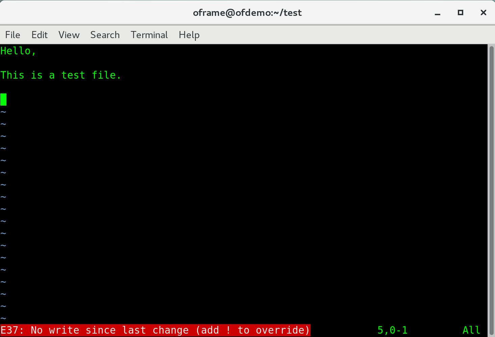

# Using VIM Editor

VIM stands for **V**i **IM**proved. It's the most common and most frequently used text editor in Linux. It's available in almost all Linux distributions, so odds are no matter what distribution you have, these commands will be available and the same.

Below are some of the most commonly used commands that can make modifying and navigating through files very fast.

## Table of Contents

- [1. Open a file with VIM](#1-open-a-file-with-vim)
- [2. Moving the Cursor](#2-moving-the-cursor)
	- [2.1 Move the Cursor to End of Line](#21-move-the-cursor-to-end-of-line)
	- [2.2 Move the Cursor to Beginning of Line](#22-move-the-cursor-to-beginning-of-line)
	- [2.3 Move the Cursor to End of File](#23-move-the-cursor-to-end-of-file)
	- [2.4 Move the Cursor to Beginning of File](#24-move-the-cursor-to-beginning-of-file)
- [3. Insert Mode](#3-insert-mode)
	- [3.1 Insert Mode at Current Position](#31-insert-mode-at-current-position)
	- [3.2 Insert Mode at End of Line](#32-insert-mode-at-end-of-line)
- [4. Deleting](#4-deleting)
	- [4.1 Delete a Line](#41-delete-a-line)
	- [4.2 Delete a Character on Cursor Position](#42-delete-a-character-on-cursor-position)
	- [4.3 Deleting in Insert Mode](#43-deleting-in-insert-mode)
- [5. Find a Pattern](#5-find-a-pattern)
	- [5.1 Go to Next Occurance of Pattern](#51-go-to-next-occurance-of-pattern)
- [6. Copy and Pasting](#6-copy-and-pasting)
	- [6.1 Copy a Line](#61-copy-a-line)
	- [6.2 Paste a Line Above Cursor Position](#62-paste-a-line-above-cursor-position)
	- [6.3 Paste a Line Below Cursor Position](#63-paste-a-line-below-cursor-position)
- [7. Saving and Exitting](#7-saving-and-exitting)
	- [7.1 Save Changes](#71-save-changes)
	- [7.2 Quit](#72-quit)

### 1. Open a File with VIM

To get started, we need to first need to know what command to open a file with VIM. In most cases, VIM will be aliased to ```vi``` which means we can save ourself typing a letter every time by just using ```vi```

```bash
vi ${file}
```
or

```bash
vim ${file}
```

### 2. Moving the Cursor

The directional keys are **H J K and L**

**J** - UP

**K** - DOWN

**H** - LEFT

**L** - RIGHT

#### 2.1 Move the Cursor to End of Line

**$**

#### 2.2 Move the Cursor to Beginning of Line

**0** 

or 

**^**

#### 2.3 Move the Cursor to End of File

**G**

#### 2.4 Move the Cursor to Beginning of File

**:1**

### 3. Insert Mode

To begin typing and backspacing, you need to be in insert mode. Once you are in insert mode, you no longer use the **H J K L** keys to navigate, instead, use the arrow keys. There are several ways to get into insert mode:

#### 3.1 Insert mode at Current Position

**i**

#### 3.2 Insert Mode at End of Line

This is how you can quickly append to the end of a line

**A**

### 4. Deleting

#### 4.1 Delete a Line

**dd**

#### 4.2 Delete a Character on Cursor Position

**x**

#### 4.3 Deleting in Insert Mode

While in Insert Mode, you can use ```backspace``` or ```delete``` to remove text from the file

### 5. Find a Pattern

**/${pattern}**

Where ${pattern} is the text you want to search for. For example, if you want to search for OPENFRAME the command would be like below:

```bash
/OPENFRAME
```

#### 5.1 Go to Next Occurance of Pattern

**n**

### 6. Copy and Pasting

#### 6.1 Copy a Line

**Y**

#### 6.2 Paste the Line Above Cursor Position

**P**

#### 6.3 Paste the Line Below Cursor Position

**p**

### 7. Saving and Exitting

The below commands can be written one at a time, or together. For Example: 

**:w**

or 

**:wq**

#### 7.1 Save Changes

**:w**

#### 7.2 Quit

**:q**

If you have already made changes to the file, it will give you a warning



In order to quite without saving, you must add an exclamation mark (!) to force quit.

**:q!**

As stated in Section 7, you can save changes and quit at the same time, by passing both **w** and **q**

**:wq**